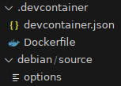

# debian_devcontainer_generator -- generate `.devcontainer` for a Debian package from `debian/control`

This script takes a folder containing a Debian package sources and generate a `.devcontainer` folder that will:

- `build-essential` package
- other usefull packages (like `git`)
- install its build-dependencies according to its `debian/control`

The generated `.devcontainer` folder is also added to `extend-diff-ignore` in `debian/source/options` so
Debian packaging scripts ignore it when generating the Debian source package (`package.debian.tar.gz`).

# Example of generated files



devcontainer.json:

```json
{
  "build": { "dockerfile": "Dockerfile" }
}
```

Dockerfile (for a package targeting unstable):

```Dockerfile
FROM debian:unstable

RUN apt-get update && apt-get install -y --no-install-recommends \
	bash \
	vim \
	git \
	gitk \
	git-buildpackage \
	ssh \
	gdb \
	less \
	build-essential \
	ninja-build

RUN apt-get update && apt-get install -y --no-install-recommends \
	debhelper-compat \
	dh-sequence-python3 \
	dh-sequence-sphinxdoc \
	python3 \
	pybuild-plugin-pyproject \
	python3-setuptools \
	python3-wheel \
	python3-certifi \
	python3-exceptiongroup \
	python3-isodate \
	python3-lxml \
	python3-pycountry \
	python3-pycryptodome \
	python3-socks \
	python3-requests \
	python3-trio \
	python3-trio-websocket \
	python3-typing-extensions \
	python3-urllib3 \
	python3-websocket \
	python3-freezegun \
	python3-pytest \
	python3-pytest-asyncio \
	python3-pytest-trio \
	python3-requests-mock
```